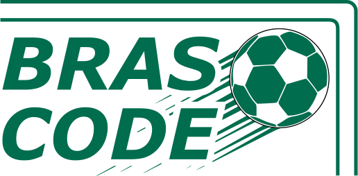
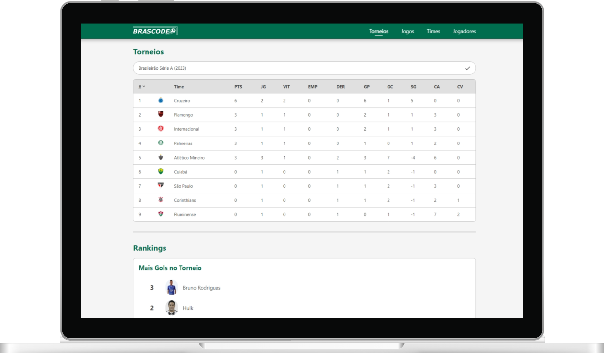
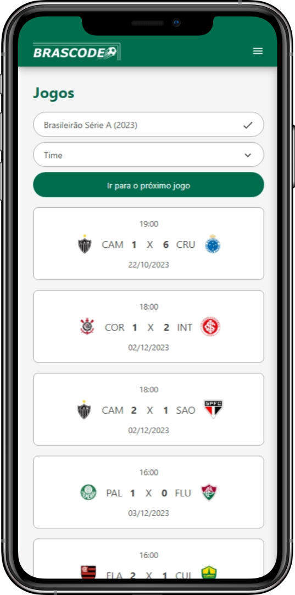

<h1>
    <p align=center>
        
    </p>
</h1>

<p align=center>
    
    &nbsp;
    
    &nbsp;
    
</p>

&nbsp;

<p align=center>
    
    &nbsp;&nbsp;&nbsp;&nbsp;
    
</p>

&nbsp;

## 💡 Motivation

This project is a component of the practical work of Databases subject at UFSJ, being able to display to the user all data about soccer tournaments, including the final standings and player rankings.

&nbsp;

## ✨ Features

### Front-End (React)

- 🧾 Advanced data retrieval
- 🔍 Search Teams and Players using filters (name, team and tournament)
- ✅ Quiz minigame
- 📱 Responsive layout (styled-components)

### Back-End (Python)

[` > Check the Back-End repository < `](https://github.com/bahdias/projeto_futebol)

&nbsp;

## 🖥️ Running the project

> The application uses NPM as the package manager, so you should have it installed before all steps

- Install the dependencies specified in `package.json`:

```bash
npm install
```

- Run the application:

```bash
npm run dev
```

- Open it on your browser!
